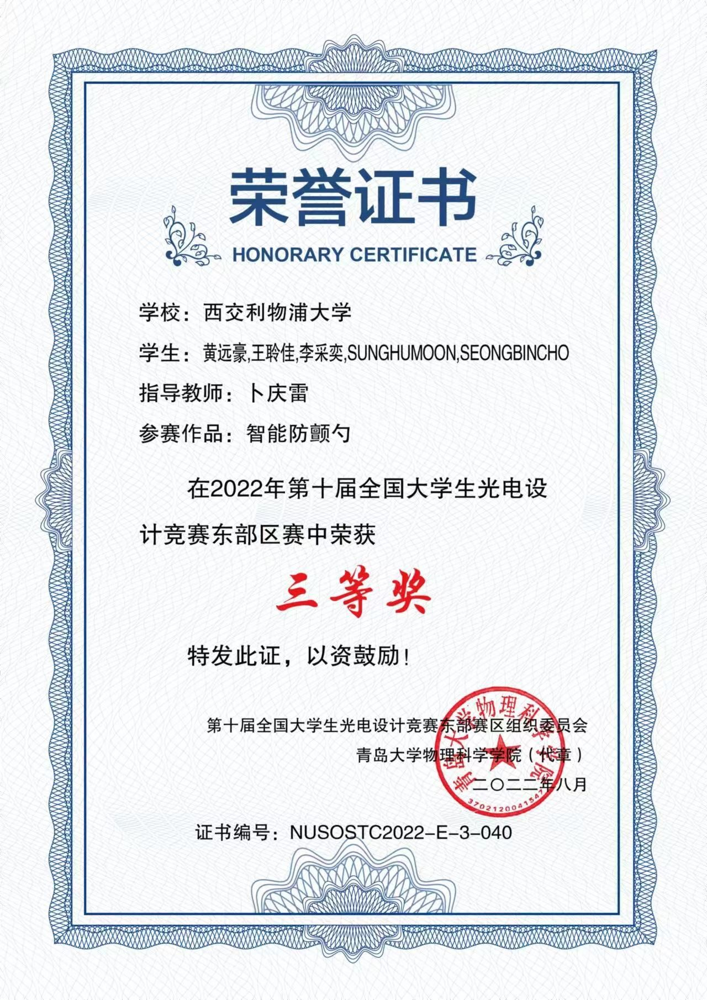
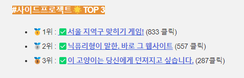
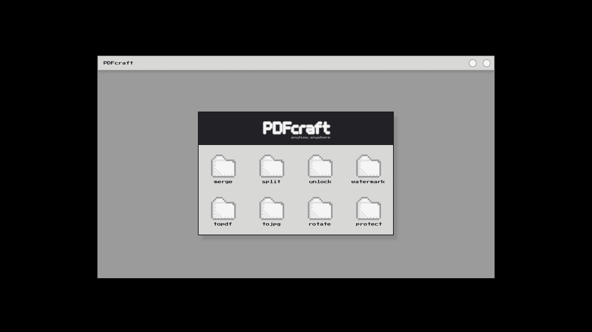
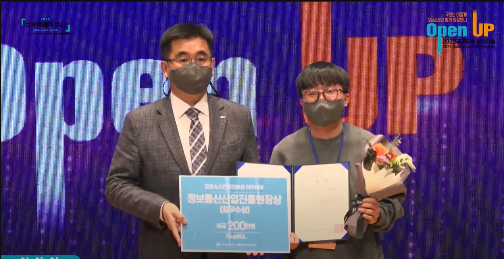
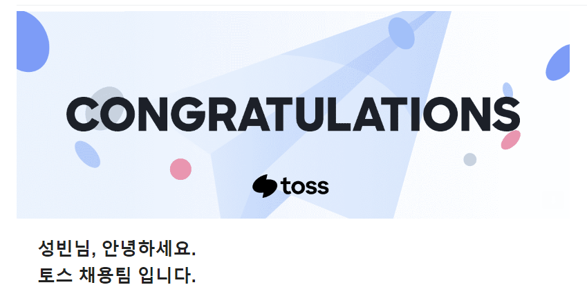

2022년은 나에게 많은 것을 가져다준 해인 것 같다. 처음으로 회고 글을 쓰려고 하니 막막함이 몰려왔다. 하지만 이 회고를 두고두고 읽을 날이 있을 것 같아 최대한 솔직하게 나의 한해를 회고해 보려고 한다.

## 복학
올해 3학년 2학기에 복학을 하였다. 1년이라는 긴 휴학 기를 마치고 복학하려고 하니 모든 것이 새롭게 느껴졌다. 아직도 온라인을 통해 대학교에 다니는 것은 적응이 안 되었다. 휴학하면서 같이 공부하며 시간을 보낸 동기들이 사라진 것도 또한 적응이 안 되어 힘들었다. 항상 나의 의문점을 해결해주던 동기들의 부재는 다행스럽게도 긍정적인 효과를 불러왔다. 내가 잘하는 것인가에 대해서 항상 고민하던 나에게 스스로 질문하고 해답을 찾는 자립심이 생기게 되었다. 아마도 지금 내가 배운 자립심은 나의 성장에 크게 작용할 것 같다. 또한 복학과 동시에 진로에 대한 걱정도 늘어난 것 같다. 전공 특성상 전기공학을 주로 배우고 있기 때문에 진로와 거리감이 느껴져서 많은 고뇌의 시간을 보내었었다. 과연 내가 지금 공부하는 것이 내 커리어에 도움이 될까에 대한 거부감이 항상 머리를 스쳤다. 힘들었다, 어리석게도 시간 낭비를 하는 것 같았다. 하지만 대학에서 배우는 것은 학문뿐만 아니라 성실함과 끈기를 배우는 것인 것을 깨달았다. 이러한 고민은 내가 진짜로 좋아하는 것이 무엇인지에 대한 확답을 주었기 때문에 의미 있는 시간이었다고 생각한다.고뇌의 시간 동안 개발에 대한 나의 마음이 더욱 확고해졌기 때문에 더욱 자신감 있게 나의 미래를 준비하고 계획할 수 있게 되었다. 이제 4학년 2학기만 남아있는 상황이다, 아직 어린 줄만 알았던 나에게 곧 대학교 졸업이 찾아온다는 사실이 믿어지지 않지만, 항상 그래왔듯 후회 없이 멋진 마무리를 하고 싶다.

## 중국 대학생 산출물 대회
3학년 2학기에 산출물을 만들어야 하는 조별 과제가 있었다. 상황이 상황인지라 대부분의 작업은 한국에 있어서 비교적 밖을 왕래하기 쉬운 내가 맡게 되었다. 모든 조원이 만날 수 없기 때문에 모든 소통은 온라인으로 이루어졌다. 나는 문자로 소통하는 것에는 오해를 불러올 소지가 있다고 생각해서 최대한 화상으로 회의를 주도해 갔다. 모두가 영어가 제 2 외국어였기에 억양과 문맥을 정확히 잘 전달하기 위해 선택한 이 방식은 탁월한 선택이라고 생각한다. 여러 회의를 거듭하며 우리의 산출물은 점점 완성되어갔으며 중간 점검 때 교수님께서는 너무 잘하고 있다며 우리의 방향을 지지해주셨다. 교수님의 지지에 힘임어 최종 발표도 잘 마무리 하였으며 산출물도 만족스럽게 잘 나왔다.

 교수님께서 질의응답 시간에 나에게 물었다 

> “ 이 프로젝트를 발전시키고 싶은 생각이 있냐?” 

그 순간 나는 소위 말하는 아부를 떨어야겠다고 생각했다. 높은 점수를 위해서 나는 조장으로써 내가할 수 있는 모든것을 해야겠다고 마음먹었었기 때문이다.나는 답했다. 

> “교수님 같은 훌륭한 교수님의 도움이 있다면 더욱 잘 발전시킬 수 있을 거 같으며,더 발전시고 싶다” 

교수님께선 미소를 지으시며 조만간 연락을 해주신다고 했다. 그때 나는 아차싶었다, 주변 분들이 우스갯소리로 항상 말씀하시던 대학원에 끌려가는게 이런 건가 하며 초조한 마음으로 연락을 기다렸다. 다행히 대학원 초대장은 아니었다, 교수님께서 TA 분을 소개해주시더니 중국 전국 대학생 산출물 대회에 학교 대표로 나가보라고 하셨다. 좋은 경험일 거 같아 일초에 망설임도 없이 출전 의사를 표했다. 

하지만 시기는 기말고사 준비 기간,빡빡한 대회 일정과 다가오는 기말고사가 나와 우리 팀원들을 힘들게 하였다.아마도 3학년 2학기의 가장 힘든 시절이 이때였을 것 같다. 갑자기 조원들에게 미안해졌다, 조원들의 동의하에 참가한 대회였지만 우리 모두 기말고사에 집중할 수 없게 된건 아닌지에 대해서 생각을 많이 하였다. 

중국 전국대회였기에 모든 서류들은 중국어로 작성되어야 했다. 내가 영어로 작성을 하면 그걸 중국어로 바꾸어야 하는 매우 번거로운 일들이었다. 또한 대회 주최측에 산출물을 보내야 했기에 중국에서 다시 산출물을 만들어야하는 상황이 일어났다. 산출물의 회로도와 프로그래밍을 모두 내가 혼자 설계하였기 때문에 이를 조원들에게 알려주는 과정도 시간을 많이 잡아먹었다. 나중에 와서 교수님도 내년으로 미루자고 제안을 하셨었다. 하지만 우리 조원들은 이미 한마음 한뜻이 되어 있었고, 힘들더라도 잘 마루리 해보자고 서로를 다독였었다.

기말준비도 대회 준비도 모두 완벽하게 하지 못하고 기말과 대회 일정이 마무리되었다. 지금 생각해도 그때 어떻게 그 많은 일들을 처리해왔는지 궁금하다. 아무런 기대도 하지 않고 하루하루를 살아가고 있었다, 어느 날 조원에게서 문자가 왔다, “우리 수상했어, 고마워 버니” . 나름 열심히 마무리한다고 했지만 아쉬움만 남았던 우리 프로젝트가 대회에서 3등을 했다는 연락이었다. 

아마 우리의 작업을 중국어로 바꾸는 데 힘을 가장 많이 쏟아준 중국인 조원들에게 너무 감사하다. 또한 항상 할 수 있다고 외치는 나를 믿어주고 지지해준 모든 조원에게 감사한 일 중 하나이다.

## 개인프로젝트
올해 초에 노마드코더라는 코딩을 배울 수 있는 웹사이트에서 파이썬 웹사이트 만들기 대회를 하였다. 파이썬은 나의 첫 개발 입문언어였기에 큰 애정을 담고 있는 언어 중 하나이다. (그래도 자바가 나의 넘버원인 것 같다). 대회전에는 개발과는 거리가 먼 다른 공부를 한 시절이라 나의 개발 열정이 MAX에 달했기 때문에 내가 보여줄 수 있는 모든 것을 담았던 것 같다. 감사하게도 많은 분들의 사랑을 받아 대상을 탈 수 있게 되었다.

나의 출중한 어그로력 덕분인지 대회 출품글이 노마드코더 클릭 수 2위라는 웃긴 사실도 최근에 알게 되었다.

본 대회를 위한 프로젝트 이외에도 아는 개발자분과 PDFCraft라는 자그마한 프로젝트를 진행했었다.

 
평소에 관심이 있던 리코일을 사용해보고 싶어 React와 Go언어를 사용하여 pdf 종합툴을 만들었다. 여러 사정으로 인하여 배포 전 단계에서 멈추었지만,개인적으로 가장 많이 성장할 수 있던 프로젝트였다고 생각한다.

올해에는 많은 프로젝트를 진행하지 못해서 아쉬웠다, 2023년에는 더 창의적이고 재미있는 사이드 프로젝트를 진행해보고 싶다.

## 오픈소스컨트리뷰톤

오픈소스 컨트리뷰톤은 작년부터 참가해 오고 있는 활동이다. 오픈소스에 기여를 하면서 배우는 점이 많다고 느꼈었기 때문에 다시 지원하게 되었다. 이번 연도에는 GlueSQL이라는 프로젝트에 참여하였다. GlueSQL은 Rust라는 언어를 사용하여 RDBMS를 구축하는 오픈소스 프로젝트이다. 평소에 Rust라는 언어에 관심이 많기도 하였고 데이터베이스는 친해지면 매우 좋은 백엔드 개발자를 목표로 하고 있었기 때문에 더욱 관심이 간 것 같다. 또한 지인분이 작년 GlueSQL 팀에 참가하시면서 들려주신 이야기들은 나의 호기심을 자극하신 것도 큰 영향을 끼친 것 같다. 이 활동을 하면서 나는 큰 기쁨을 받은 것 같다. 대학 생활에서 충족시키지 못했던 개발에 대한 갈증을 해결해 주는 사막의 오아시스와 같은 존재였다. 아마 이 때문인지 더욱 열심히 황동에 임했던 것 같다. GlueSQL에서 활동을 하며 중간발표와 최종 발표를 모두 이끌었다. 내 노력에 부응하듯 두 발표 모두 발표 상을 받았다. 새벽까지 같이 발표 준비를 도와주신 멘토와 멘티님들께 감사하다는 말을 전하고 싶다. 멘토와 멘티분들의 피드백 덕분에 발표 상을 받을 수 있던 것 같다. 발표상 이외에도 멘토와 멘티분들의 노력으로 오픈소스컨트리뷰션에서 최우수상이라는 좋은 결과도 얻을 수 있었다.

GlueSQL을 하면서 가장 기억에 남은 PR은 아마도 이 [PR](https://github.com/gluesql/gluesql/pull/844)인 것 같다. 가장 많은 시간과 공을 많이 들인 PR이었기 때문인것 같다. 기존에는 비교적 간단한 AST Builder에 기여를 했었지만, 더욱 core 한 부분을 작업한다는 것에 대한 자부심도 있었던 것 같다.  Rust 언어의 특성상 Lifetime 이라는 개념과 Type에 대한 강력한 규제 때문에 한달이 넘도록 고민하고 보완해 나간 PR 이었다. 또한 하나의 Data type 추가는 기존에 있던 모든 Data type에 영향을 주기때문에 새로운 casting rule도 또한 필요하였다. 멘토분들과 긴 시간 의논 끝에 새로운 casting rule을 정하는 것을 시작으로 하나하나 추가를 해 나아가며 완성을 했던 기억이 난다.

오픈소스 컨트리뷰션의 공식 일정을 마무리되었지만 아직도 GlueSQL 팀과 기여를 지속하고 있다.

## 토스

아무래도 2022년 한 해를 행복하게 마무리할 수 있도록 해준 소식인 것 같다. 2022년 12월 Toss라는 회사에 Internal Tribe Assistant로 합류하게 되었다. 비록 Assistant 라는 포지션이지만 개발자로 성장하는 과정 일부라고 생각한다. 아직 토스에서 일을 시작한 지는 일주일 채 되지 않았다.

토스에서의 하루하루는 정말 아름다웠다. 특히 퇴근 전의 테헤란로의 야경은 서울에서의 직장 생활을 동경하던 나에겐 너무나 큰 자극이 되는 것 같다. 또한 토스의 모든 분이 너무 따듯하게 해주셔서 빠르게 새로운 환경에 적응할 수 있었다. 특히 사수분의 도움이 가장 컸던 것 같다, 사수분께서 내가 해야 할 업무에 대해서 너무 잘 설명을 해주셔서 나는 별도의 연습 기간 없이 티켓을 배정받아 처리를 할 수 있었다. 사수분의 완벽한 다이렉팅덕분에 짧은 시간에 많은 경험을 할 수 있던 것 같다. 토스에서 Asistant로 일하면서 개발자분들과 협업을 하는 방법을 완벽하게 익히고 싶다. 큰 회사의 workflow와 어떻게 소통을 해야 효율적으로 일을 처리할 수 있는지에 대해서 습득한다면 다른 회사에서도 이 경험이 잘 작용할 거하고 생각한다. 개발자들의 일의 7할은 협업이기 때문에 이 소통 능력을 잘 발전시킨다면 좋은 개발자가 될 수 있다고 생각하기 때문에 이 소중한 기회를 꼭 제대로 활용하고 싶다.

사실 아직까지도 내가 이 포지션에 합격한 것이 실감이 나지 않는다, 물론 출근을 한지 얼마 안된것이 한몫 하는것 같다.나에게 이런 좋은 기회를 주신 토스팀 분들께 감사를 표하고 싶다. 현재 나는 토스에서의 날들을 매일 기록하고 있다, 3개월이 지나 나의 여정들을 되돌아 보고 싶어서이다. 또 나의 실수들과 내가 배운점들을 하나하나 기록하다보면 더 성장해 있을 나를 위해서 이기도 하다.

## 맺으며,,,
2023년도의 해는 이미 밝았다. 아직 개발자 지망생으로서의 삶을 살아가고 있지만 올해에는 대학 졸업이라는 산과 개발자로의 취직이라는 산을 넘어 더 성장한 내가 되고 싶다. 객관적으로 나를 판단한다면 나는 아직 많이 부족하고 배울점이 많은 사람이기에 항상 겸손한 자세로 모든 일에 임하려고 한다. 2022년 좋은분들의 조언덕분에 방황하지 않고 나의 길을 찾은것 같아 감사하고, 꼭 좋은 개발자로 성공하여 그분들을 뿌듯하게 하고 싶은 욕심이 생겼다. 2023년에 회고록에는 취직한 나를 회고하는 일이 있기를 바라며 2022년 나의 회고록을 맺으려 한다. 