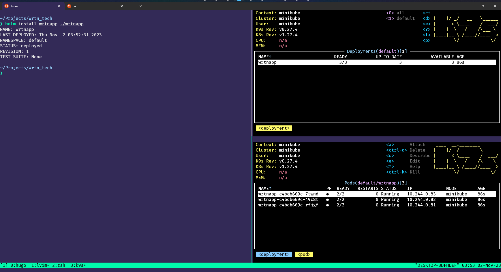

## Helm 차트란
Helm 차트는 `Kubernetes` 애플리케이션을 패키징하고 배포하기 위한 패키지이다.   
차트는 `Kubernetes` 애플리케이션의 구성, 리소스 정의, 종속성 등을 포함하는 디렉토리 구조로 구성되어있다.   
이러한 차트를 사용하면 애플리케이션을 쉽게 배포하고 관리할 수 있다.   

## Helm 차트의 구성요소
Helm 차트는 크게 두 가지 주요 요소로 구성된다. 첫 번째는 "Chart.yaml" 파일로, 이 파일에는 차트의 기본 정보인 이름, 버전, 설명 등이 포함된다.    
두 번째는 "templates" 디렉토리로, 여기에는 `Kubernetes` 리소스(예: Deployment, Service, ConfigMap 등)의 템플릿 파일이 포함된다. 
이 템플릿 파일은 차트를 배포할 때 사용자가 제공한 값에 따라 동적으로 생성되며, `Kubernetes` 클러스터에서 애플리케이션을 배포할 때 이 템플릿이 실제 리소스로 변환된다.

### Helm 차트와 종속성
Helm 차트는 종속성을 가질 수 있다. 종속성은 다른 Helm 차트를 참조하여 필요한 애플리케이션 구성을 가져올 수 있는 기능이다.    
이를 통해 애플리케이션 간의 종속성을 관리하고 재사용 가능한 구성 요소를 쉽게 활용할 수 있다.
Helm 차트를 사용하면 애플리케이션의 배포, 업그레이드, 롤백 등을 단순화할 수 있으며, 버전 관리와 구성 관리를 효율적으로 수행할 수 있다.

## Helm 차트 설치하기
Helm을 설치하기 위해서는 우선 해당 공식 [페이지](https://helm.sh/)에 접속한다.   
사용하고 있는 환경에 맞는 바이너리를 설치한다. 필자는 `homebrew`를 이용하여 설치할 것이다.   
```properties
brew install helm
```

## Helm 사용하기
우선 helm 차트를 생성해보도록하자. Helm은 해당 명령어로 기본적인 파일 구조를 설정할 수 있도록 한다.   
```properties
helm create [name of the chart]
```
해당 명령어를 통해 다음과 같은 `directory`가 생성되었다.   
```
├── Chart.yaml
├── charts
├── templates
│   ├── NOTES.txt
│   ├── _helpers.tpl
│   ├── deployment.yaml
│   ├── hpa.yaml
│   ├── ingress.yaml
│   ├── service.yaml
│   ├── serviceaccount.yaml
│   └── tests
│       └── test-connection.yaml
└── values.yaml
```
여기서 templates ditectory 안에 있는 파일들은 삭제 하여도 무관하다, 직접 만들어줄것이기 때문이다.  

### Helm 작성하기

```yaml
apiVersion: apps/v1
kind: Deployment
metadata:
  name: {{ .Release.Name }}
  labels: 
    app: {{ .Release.Name }}
spec:
  replicas: {{.Values.replicas}}
  selector:
    matchLabels:
      app: wrtnapp
  template:
    metadata:
      labels:
        app: wrtnapp
    spec:
      containers:
      - name: flask-container
        image: {{.Values.image.flask }}
        ports:
        - containerPort: 5000
      - name: redis-container
        image: {{.Values.image.redis}}
        ports:
        - containerPort: 6379

```

해당 파일은 `templates/deployment.yaml`의 예시이다. 필자는 개인적으로 `jinja2`문법이 생각나는 부분이었다.   
해당 값들은 상위 directory에 있는 `values.yaml` 에 작성한 값들을 가져올 수 있다.   
```yaml
replicas: 3

image:
  flask: "chobobdev14/flask-backend:latest"
  redis: "redis:latest"
```
위 값들은 `values.yaml`에 작성되어 있는 값들이다. `Helm`을 `Kubernetes`애 install할때 값이 자동으로 적요이 된다.   
추가로 `container`당 하나의 `service.yaml` 파일이 필요하다. 따라서 `flask-service.yaml`과 `redis-service.yaml`이 있다.

```yaml
# flask-service.yaml
apiVersion: v1
kind: Service
metadata:
  name: flask-service
spec:
  selector:
    app: {{ .Release.Name }}
  ports:
  - protocol: TCP
    port: 80
    targetPort: 5000
  type: LoadBalancer
```
및
```yaml
# redis-service.yaml
apiVersion: v1
kind: Service
metadata:
  name: redis-service
spec:
  selector:
    app: {{ .Release.Name }}
  ports:
  - protocol: TCP
    port: 6379
    targetPort: 6379
  type: LoadBalancer
```
으로 작성될 수 있다.   

### Helm 설치해보기

```properties
❯ helm install wrtnapp ./wrtnapp
NAME: wrtnapp
LAST DEPLOYED: Thu Nov  2 03:52:31 2023
NAMESPACE: default
STATUS: deployed
REVISION: 1
TEST SUITE: None
```

다음과 같이 설치를 하면 

위 사진과 같이 정상적으로 배포가 된것을 알 수 있다. 만약 chart에 업그레이드 하는 경우가 있다면 
```properties
helm upgrade wrtnapp ./wrtnapp
```
다음 명령어를 실행하여 변경사항을 반영하게 하면 된다. 추가로 해당 chart를 삭제하고 싶다면 `helm uninstall wrtnapp` 을 실행하면 된다.  

