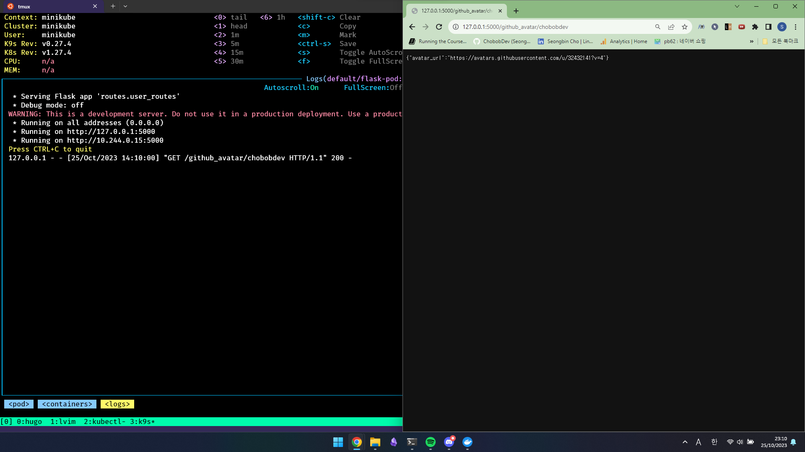

## Minikube란?

`Minikube`는 `Kubernetes`와 같은 `Container Orchestration` 오픈소스 이다.   
하지만 이름에서 짐작할 수 있듯이 `Minikube`는 `Kubernetes`의 작은 버전이라고 이해하면 쉽다.      
`Minikube`는 로컬 개발 환경에서 `Kubernetes`를 쉽게 사용할 수 있도록 도와주는 도구이다.   
싱글 노드 `Kubernetes` 클러스터를 단일 사용자의 PC위에 구축해주며, 이를 통해 사용자는 `Kubernetes` API를 배우거나, 테스트, 개발 등의 작업을 로컬 환경에서 수행할 수 있다.   

### Minikube 설치
`Minikube`를 설치하기 위해서는 도커와 `kubectl`이 설치 되어 있어야 한다.  
`Minikube`의 설치는 해당 [사이트](https://minikube.sigs.k8s.io/docs/start/)에서 환경에맞게 설치 하면 된다.   


### Minikube 사용하기
우선 `minikube`의 사용법을 알아보자.   
```properties
minikube start
```
다음 명령어는 클러스터를 생성한다. 도커가 정상적으로 설치되어 실행중이라면 다음과 같은 화면이 나온다.   


클러스터가 잘 생성되었는지는 다음과 같이 확인 할 수 있다.


이외에도 다음과 같은 명령어들이 존재한다.   
클러스터 일시정지(`minikube pause`), 클러스터 재가동(`minikube unpause`), 클러스터 종료(`minikube stop`) 및 클러스터 삭제(`minikube delete`) 등이 있다.   

## Minikube 와 Pod
`Pod`는 `Kubernetes`에서 배포할 수 있는 가장 작은 단위이다, `Pod`에는 하나 이상의 컨테이너를 포함하고 있다.   
기존에 만들었던 `Kubernetes Cluster`에 `Pod` 단위로 컨테이너들을 배포할 수 있다.   

### Pod 생성하기

`pod`는 위와 같이 정의될 수 있다. 

```properties
kubectl apply -f flask-pod.yaml
```
위 명령어를 입력하면 정의된 `pod`를 `Kubernetes Cluster`에 추가할 수 있다. 


`kubectl get pods`를 통해 pod가 정상적으로 추가된 것을 확인 할 수 있다.      


## K9s란?
K9s는 Kubernetes 클러스터를 관리하기 위한 터미널 기반 UI 도구이다.   
K9s를 사용하면 터미널에서 Kubernetes 리소스를 시각적으로 탐색하고 모니터링하며, 실시간으로 클러스터 상태를 확인할 수 있다.    
K9s를 사용하면 Pod, 서비스, 노드, 네임스페이스 등의 Kubernetes 리소스를 쉽게 검색하고, 조회, 생성, 수정, 삭제 등의 작업을 수행할 수 있다.   

### K9s 설치
`K9s`는 해당 [링크](https://k9scli.io/topics/install/)에서 쉽게 설치할 수 있다.   

### K9s 실행
```properties
k9s -c pods
```
다음과 같이 명령어를 작성하면 `Kubernetes Cluster`상 추가되어 있는 `Pods`를 확인 할 수 있다.   


`K9s`를 활용하면 `Pod`안 컨테이너들에 접근하여 작업을 수행할 수 있다.   

위 사진에서 알 수 있듯이 `K9s`는 `Pods`에 띄어진 컨테이너에 접근할 수 있도록 해준다.   



```properties
kubectl port-forward flask-pod 5000:5000
```
해당 명령어로 host에서 `Kubernetes Cluster`상의 `pod`에 접근할 수 있도록 하여 브라우저로 요청을 하면 사진에서 볼 수 있듯이 로그가 찍히는걸 확인 할 수 있다.   

