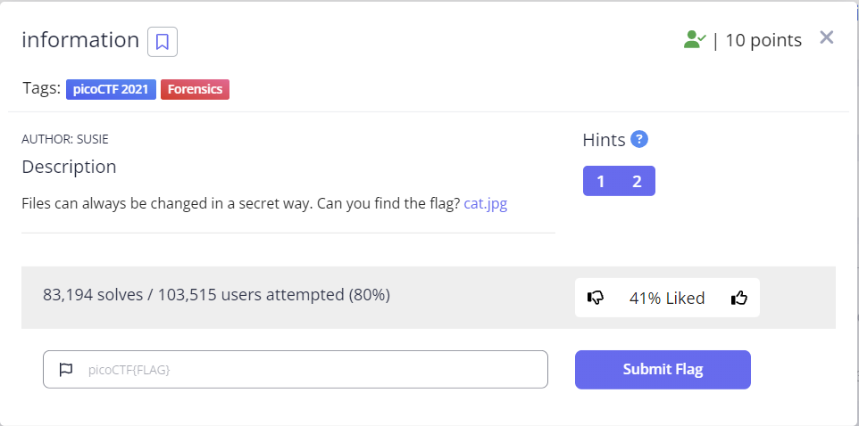

## 문제


```
Files can always be changed in a secret way. Can you find the flag? cat.jpg
```

## 풀이
문제를 풀기전 카테고리를 확인하는 것은 문제를 해결하는 시간을 단축 시킬 수 있다.   
> 해당 중요성을 느껴 금일 필자는 그동안 푼 문제들에 `tag`들을 일괄 수정하였다. 

`Forensics` 이란 쉽게 말해 부검 이라고 이해하면 된다, 우리는 주어진 `cat.jpg` 라는 파일을 부검 하면 된다.   
필자는 `cat.jpg`의 메타데이터를 읽어보는것이 좋을것이라고 판단하고 메타데이터를 terminal에 출력해 보았다.   

```
❯ exiftool cat.jpg
ExifTool Version Number         : 12.40
File Name                       : cat.jpg
Directory                       : .
File Size                       : 858 KiB
File Modification Date/Time     : 2021:03:16 03:24:46+09:00
File Access Date/Time           : 2023:09:28 23:01:04+09:00
File Inode Change Date/Time     : 2023:09:28 23:01:04+09:00
File Permissions                : -rw-r--r--
File Type                       : JPEG
File Type Extension             : jpg
MIME Type                       : image/jpeg
JFIF Version                    : 1.02
Resolution Unit                 : None
X Resolution                    : 1
Y Resolution                    : 1
Current IPTC Digest             : 7a78f3d9cfb1ce42ab5a3aa30573d617
Copyright Notice                : PicoCTF
Application Record Version      : 4
XMP Toolkit                     : Image::ExifTool 10.80
License                         : cGljb0NURnt0aGVfbTN0YWRhdGFfMXNfbW9kaWZpZWR9
Rights                          : PicoCTF
Image Width                     : 2560
Image Height                    : 1598
Encoding Process                : Baseline DCT, Huffman coding
Bits Per Sample                 : 8
Color Components                : 3
Y Cb Cr Sub Sampling            : YCbCr4:2:0 (2 2)
Image Size                      : 2560x1598
Megapixels                      : 4.1
```
해당 값들에서 가장 눈에 띄는 값은 바로 `License` 값이었다.  

`cGljb0NURnt0aGVfbTN0YWRhdGFfMXNfbW9kaWZpZWR9` 을 보면 잘 모르겠다,,, ㅎㅎㅎㅎ   
찾아보니 해당 값은 `base64` 로 인코딩 되어 있는 값이라고 한다.   

```
echo cGljb0NURnt0aGVfbTN0YWRhdGFfMXNfbW9kaWZpZWR9 | base64 -d
```
자 linux 커멘드를 이용해서 `flag` 를 리턴받아 보자.   
`picoCTF{the_m3tadata_1s_modified}%`를 리턴받았으므로 제출해야할 `flag` 는 `picoCTF{the_m3tadata_1s_modified}` 이다.    

