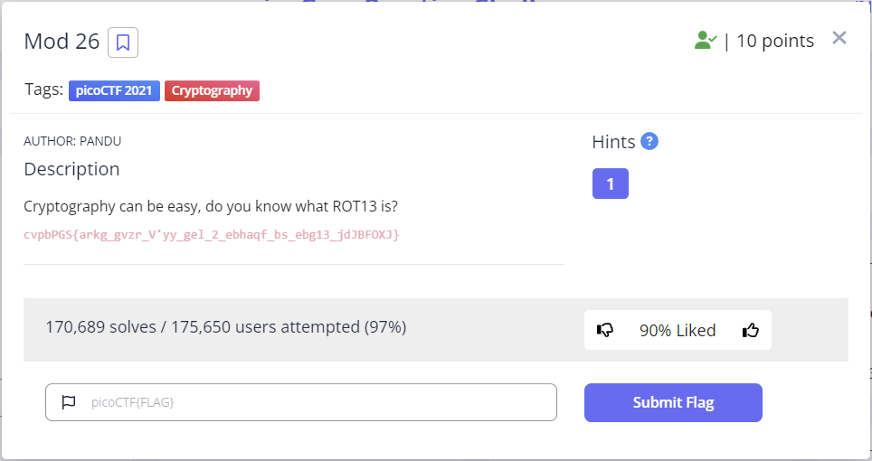

## 문제


```
Cryptography can be easy, do you know what ROT13 is?
cvpbPGS{arkg_gvzr_V'yy_gel_2_ebhaqf_bs_ebg13_jdJBFOXJ}
```

## 풀이

해당 문제는 생각보다 straightforward 하다. 
주어진 문자열을 단순히 `ROT13` 으로 decode 하기만 하면 된다.   
온라인 decoder를 활용할 수 도 있지만 python으로 단순히 decoder를 구현할 수 있다.

```python
import sys
n=sys.argv[1]
result=''.join([chr((ord(letter) - 97 + 13) % 26 + 97)
                        if 97 <= ord(letter) <= 122
                        else letter
                    for letter in n.lower()])
print(result)

```
 해당 코드는 argument로 받은 문자열을 `ROT13`으로 decode 해주는 코드이다.

 ```
python3 mod26_sol.py "cvpbPGS{arkg_gvzr_V'yy_gel_2_ebhaqf_bs_ebg13_jdJBFOXJ}"
 ```

 다음과 같이 해당 코드를 실행하면 
 ```
 picoctf{next_time_i'll_try_2_rounds_of_rot13_wqwosbkw}
 ```
제출해야할 `flag`가 리턴된것을 볼 수 있다. 
