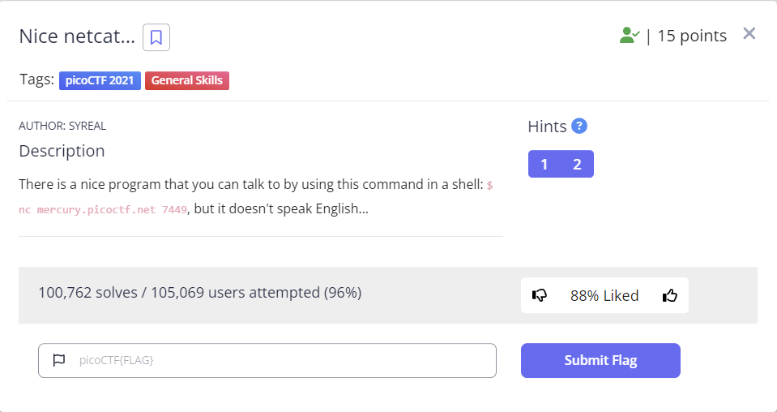

## 문제

```
There is a nice program that you can talk to by using this command in a shell: $ nc mercury.picoctf.net 7449, but it doesn't speak English...
```

## 풀이

우선 문제에서 하라는대로 터미널에 다음 스크립트를 실행시켜 보자.   
```
nc mercury.picoctf.net 7449
```
그러자 다음과 같은 값을 리턴 받았다.   
```
112
105
99
111
67
84
70
123
103
48
48
100
95
107
49
116
116
121
33
95
110
49
99
51
95
107
49
116
116
121
33
95
102
50
100
55
99
97
102
97
125
10
```
어라??? `112`는 `p`의 `ASCII` 값인데,,,, 추가적으로 `105`,`99`,`111` 도 추가로 변환해 보니 각각 `i`,`c`,`o` 으로 확인된다.   
따라서 리턴받은 값들을 `ASCII` 코드로 디코드 해본다면 다음과 같은 값을 확인할 수 있다.   
다음은 디코딩을 해주는 간단한 명령어 이다.   
```shell
echo "112 105 99 111 67 84 70 123 103 48 48 100 95 107 49 116 116 121 33 95 110 49 99 51 95 107 49 116 116 121 33 95 102 50 100 55 99 97 102 97 125 10" | tr ' ' '\n' | while read -r ascii; do echo -n "$(printf "\\$(printf %o "$ascii")")"; done
```
다음을 터미널에 실행시킨다면 우리는 다음과 같은 값을 얻을 수 있다.   
```
picoCTF{g00d_k1tty!_n1c3_k1tty!_f2d7cafa}%
```
따라서 해당 문제의 `flag`는 `picoCTF{g00d_k1tty!_n1c3_k1tty!_f2d7cafa}` 이라는걸 알 수 있다.   
