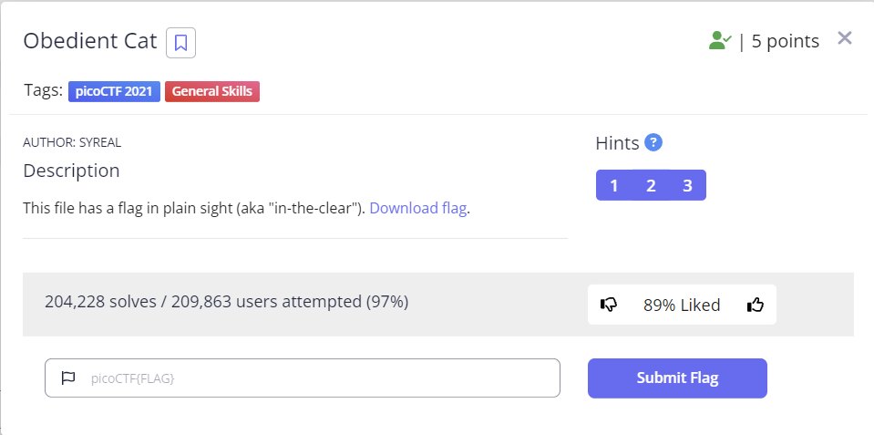

## CTF란
CTF는 Capture the Flag 의 Acronym 이다. CTF는 숨겨져 있는 Flag를 찾아 제출하면 되는 일종의 게임이라고 이해하면 쉽다.

## 문제



```
This file has a flag in plain sight (aka "in-the-clear"). Download flag.
```
## 풀이

해당 문제는 CTF는 이런것이다 정도를 알려주는 간단한 문제였다.
단순하게 파일을 우선 다운로드 해보자. 필자는 linux 환경에서 진행을 한다고 가정을 하고 풀이과정을 작성하였다.

```
wget https://mercury.picoctf.net/static/704f877da185904ec3992e7255a15c6c/flag
```

그 이후 단순히 다운로드된 파일을 cat으로 출력해보면 된다.
```
cat flag
```
터미널에 다음과 같이 출력되는것을 볼 수 있다.
```
picoCTF{s4n1ty_v3r1f13d_1a94e0f9}
```
해당 부분이 바로 우리가 앞으로 제출해야할 `flag` 이다. `flag` 는 다음과 같이 `picoCTF{xxxxxx}` 포멧을 가진다.
터미널의 내용을 복사하여 제출하면 `Obedient Cat` 문제를 해결할 수 있다.

