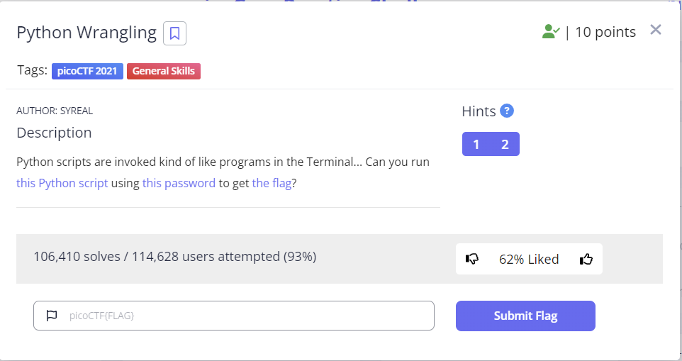

## 문제


```
Python scripts are invoked kind of like programs in the Terminal... 
Can you run this Python script using this password to get the flag?
```

## 풀이
해당 문제를 풀기 위해서는 우선 [Python script](https://mercury.picoctf.net/static/5c4c0cbfbc149f3b0fc55c26f36ee707/ende.py) 와 [password](https://mercury.picoctf.net/static/5c4c0cbfbc149f3b0fc55c26f36ee707/pw.txt)파일 그리고 [flag](https://mercury.picoctf.net/static/5c4c0cbfbc149f3b0fc55c26f36ee707/flag.txt.en)를 다운로드 받아야 한다.
해당 파일들을 다운로드 받기 위해서는 다음 명령어를 리눅스 환경에서 실행해 보면 된다.

```
wget https://mercury.picoctf.net/static/5c4c0cbfbc149f3b0fc55c26f36ee707/ende.py && 
wget https://mercury.picoctf.net/static/5c4c0cbfbc149f3b0fc55c26f36ee707/pw.txt &&
wget https://mercury.picoctf.net/static/5c4c0cbfbc149f3b0fc55c26f36ee707/flag.txt.en
```
다음 명령어는 이번 문제를 해결할때 필요한 파일들을 다운로드를 한다.   
우선 실행이 되어야 할 파이썬 파일을 실행시켜 보자. 리눅스 환경에서는 `python 3.x.x` 기준 호출 명령어의 prefix는 `python3` 이다.   
```
python3 ende.py
```
실행 결과는 다음과 같다. 
```
Usage: ende.py (-e/-d) [file]
```
해당 아웃풋을 읽어 보면 해당 파일은 실행을 할때 2개의 인자를 받아야 하는것으로 해석될 수 있다.    
실제 주어진 파이썬 스크립트를 확인해보면   

```python
if len(sys.argv) < 2 or len(sys.argv) > 4:
    print(usage_msg)
    sys.exit(1)
```
다음과 같이 `sys.argv` 의 크기를 3~4로 제한하고 있다.   
여기서 `sys.argv` 는 터미널 환경에서 파일을 실행시킬때 `python3` 뒤에 주어진 모든 인자들의 `list` 라고 이해하면 된다.      
따라서 해당 파이썬 파일은 `python3 ende.py` 뒤에 2개에서 3개의 인자를 추가로 받을 수 있는 것이라고 보면 된다.   

```python
if len(sys.argv) < 4:
        sim_sala_bim = input("Please enter the password:")
    else:
        sim_sala_bim = sys.argv[3]

```
추가로 해당 코드를 분석해 보면 `ende.py` 는 3개의 인자를 받으면 비밀번호를 추가로 요청하며,
처음부터 비밀번호를 포함하여  총 4개의 인자를 주는  총 2가지 방법으로 호출될 수 있다는것을 알 수 있다.    
현재는 `decode` 를 해야하는 상황이기에 인자를 `-d` 로 호출할 것이다. 비밀번호는 주어진 텍스트 파일을 열어 확인할 수 있다.

```
cat pw.txt
```
따라서 아래 스크립트와 같이 실행할 `파이썬 파일` , `실행모드 (인코드/디코드)` , `변환할 파일`, `비밀번호` 순으로 인자를 작성해주면 된다.   

```
 python3 ende.py -d flag.txt.en 192ee2db192ee2db192ee2db192ee2db
```

다음을 실행시키면 
`picoCTF{4p0110_1n_7h3_h0us3_192ee2db}` 를 리턴한다.


