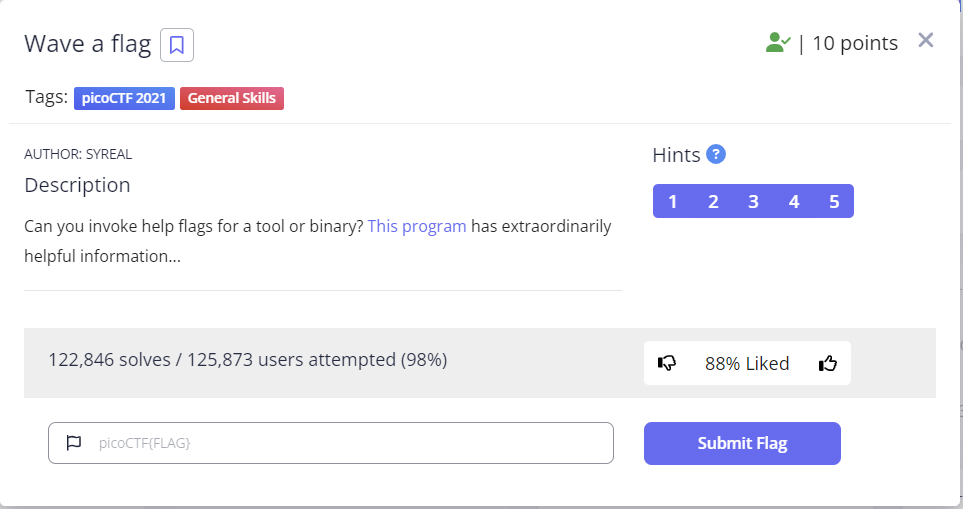
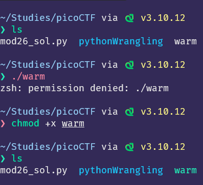
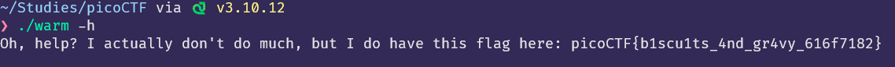

## 문제



```
Can you invoke help flags for a tool or binary? This program has extraordinarily helpful information...
```

## 풀이
해당 문제를 풀기 위해서는 우선 주어진 [This program](https://mercury.picoctf.net/static/beec4f433e5ee5bfcd71bba8d5863faf/warm)을 다운로드 받아야 한다.   


```
wget https://mercury.picoctf.net/static/beec4f433e5ee5bfcd71bba8d5863faf/warm
```
파일이 다운로드가 마무리 되었다면, 다운로드가된 프로그램을 실행시켜야 한다.   
```
./warm
```

프로그램을 실행시키려고 한다면 다음과 같은 에러를 마주할것 이다.   

```
zsh: permission denied: ./warm
```

오류 메세지를 읽어보면 해당 프로그램을 실행할 권한이 없기 때문에 발생하는 문제이다. 따라서 간단한 linux 명령어로 실행권한을 부여하면 된다.   
```
chomod +x warm
```
해당 명령어를 실행하면 터미널에서 해당 파일을 실행시킬 수 있게되며 다음 사진과 같이 색상이 다르게 표현된다.   
<center>



</center>

이후 해당 프로그램을 실행한다면 다음과 같은 결과를 얻을 수 있다.
```
Hello user! Pass me a -h to learn what I can do!
```
해당 프로그램은 `-h` 인자를 넘겨주길 원하고 있다. 따라서 다음과 같이 실행을 시켜준다면 우리는 `flag`를 얻을 수 있다.   


따라서 해당 문제의 `flag` 는 `picoCTF{b1scu1ts_4nd_gr4vy_616f7182}` 이다.
