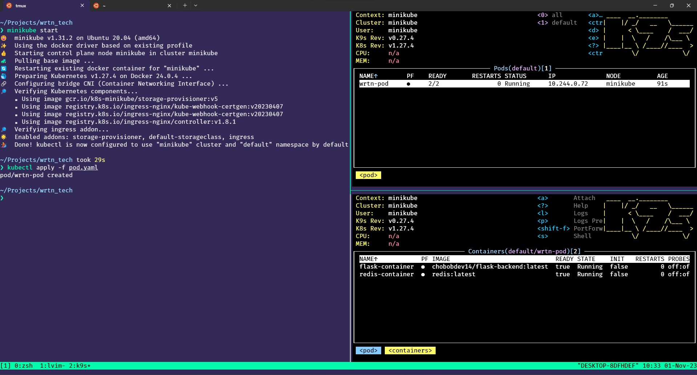
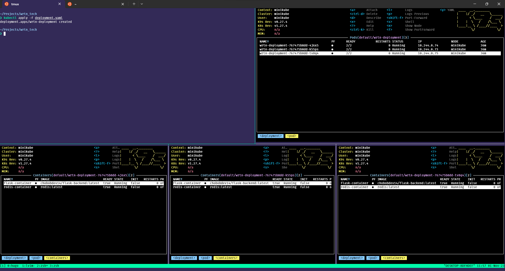
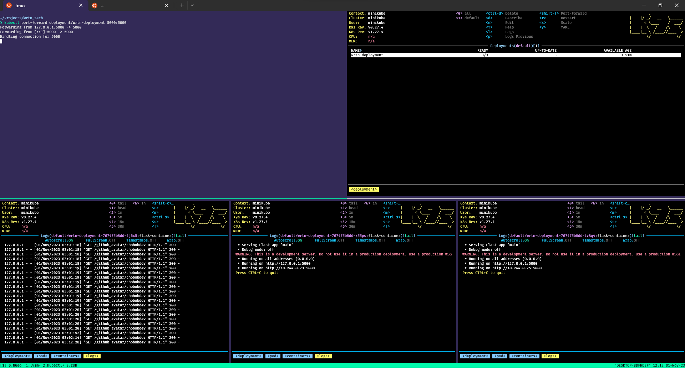

## Pod에 다중 컨테이너 올리기
이전 글에서는 Pod에 하나의 컨테이너를 추가해서 `minikube`에 배포해보았다.   
이번에는 기존에 만들어둔 `pod`에 `redis` 스토리지를 추가하여 하나의 `pod`에 다중 컨테이너를 띄어볼것이다.   
하나의 `Pod`에 있는 컨테이너들은 동일한 네트워크 인터페이스를 공유하기에, 로컬호스트를 통해 통신할 수 있다.   

### pod.yaml 작성하기

```yaml
apiVersion: v1
kind: Pod
metadata:
  name: wrtn-pod
spec:
  containers:
  - name: flask-container
    image: chobobdev14/flask-backend:latest
    ports:
    - containerPort: 5000
  - name: redis-container
    image: redis:latest
    ports:
    - containerPort: 6379
```

`pod.yaml` 을 작성하는 방법은 기존 `containers` 에 추가하고 싶은 컨테이너를 작성해주면 된다.   



다음 화면에서 알 수 있듯이 `minikube`에 2개의 `container`가 잘 배포가 된 것을 알 수 있다.   

## Deployment 사용해보기
`pods`는 일시적이며 단일 목적으로 사용되는 실행 단위이며 일회성이기 때문에 장애 혹은 업그레이드 시에는 새롭게 `pod`를 생성하여야 한다.   
이러한 문제점들은  `Deployment` 활용하면 해결할 수 있다.   
`Deployment`는 롤링 업데이트, 롤백, 스케일링 등과 같은 배포 관리 작업을 쉽게 수행할 수 있는 기능을 제공한다.    
또한 `Deployment`는 `Pod`의 상태를 지속적으로 확인하고 필요한 경우 `Pod`를 자동으로 복구할 수 있다.    
`Deployment`를 사용하면 애플리케이션의 로드 밸런싱과 고가용성을 보장할 수 있다.   

### Deployment.yaml 작성하기

```yaml
apiVersion: apps/v1
kind: Deployment
metadata:
  name: wrtn-deployment
spec:
  replicas: 3
  selector:
    matchLabels:
      app: wrtn-pod
  template:
    metadata:
      labels:
        app: wrtn-pod
    spec:
      containers:
      - name: flask-container
        image: chobobdev14/flask-backend:latest
        ports:
        - containerPort: 5000
      - name: redis-container
        image: redis:latest
        ports:
        - containerPort: 6379
```
 `Deployment.yaml`은 위 `pod.yaml`와 거의 유사한 형태를 가지고 있다.   
 그중 `replicas`를 눈여겨 볼 필요가 있는데 해당 값은 지정된 갯수의 pod 인스턴스를 유지하도록 보장한다.   
 해당 설정값이 애플리케이션의 로드 밸런싱과 고가용성을 보장할 수 있게 해주는 부분이다.   
 앞서 서술했듯이 지정된 갯수를 보장하는것이며 필요에 따라 인스턴스를 더 생성하여 고가용성을 보장하는 것이라고 이해하면 된다.   


`deployment`를 `k9s` 상에서 확인하려면 다음과 같은 명령어를 실행하면 된다.
```
k9s -c dp
```



위 화면에서 알 수 있듯이 `deployment`에는 3개의 `pod`인스턴스가 있으며 각각의 `pod`에는 2개의 `cotainer`가 올라가 있는것을 알 수 있다.   

배포된 `deployment`에 접근을 하고 싶다면 포트포워딩이 필요하며 다음과 같이 실행을 시키면 된다.   


```properties
kubectl port-forward deployment/wrtn-deployment 5000:5000
```



다음 화면과 같이 포트포워딩을 통해 정상적으로 `pod`에 도달하는것을 알 수 있다.   

