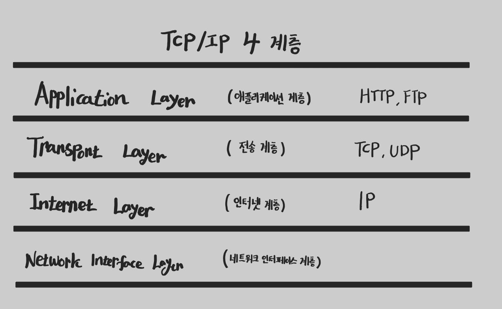

[이곳](https://chobobdev.github.io/p/%EB%AA%A8%EB%93%A0-%EA%B0%9C%EB%B0%9C%EC%9E%90%EB%A5%BC-%EC%9C%84%ED%95%9C-http-%EC%9B%B9-%EA%B8%B0%EB%B3%B8-%EC%A7%80%EC%8B%9D1.2%EC%9D%B8%ED%84%B0%EB%84%B7-%ED%94%84%EB%A1%9C%ED%86%A0%EC%BD%9Cip/)에서 설명했듯이 IP 프로토콜 만으로는 Packet의 도착 혹은 순서대로 도착하는 것을 보장할 수 없다.

## 인터넷 프로토콜 스택의 4계층



## TCP 프로토콜이란

## UDP 프로토콜이란

> 본 글은 김영한 님의 [모든 개발자를 위한 HTTP 웹 기본 지식](https://www.inflearn.com/course/http-%EC%9B%B9-%EB%84%A4%ED%8A%B8%EC%9B%8C%ED%81%AC/dashboard)을 보고 정리한 글입니다.