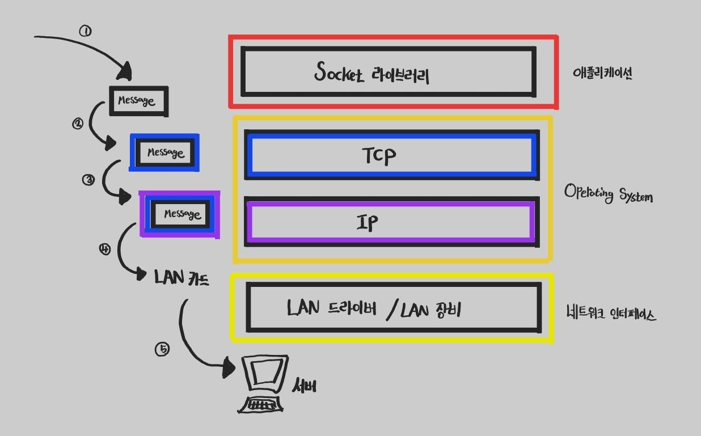

> [이곳](https://chobobdev.github.io/p/%EB%AA%A8%EB%93%A0-%EA%B0%9C%EB%B0%9C%EC%9E%90%EB%A5%BC-%EC%9C%84%ED%95%9C-http-%EC%9B%B9-%EA%B8%B0%EB%B3%B8-%EC%A7%80%EC%8B%9D1.2%EC%9D%B8%ED%84%B0%EB%84%B7-%ED%94%84%EB%A1%9C%ED%86%A0%EC%BD%9Cip/)에서 설명했듯이 IP 프로토콜 만으로는 Packet의 온전한 도착을 보장할 수 없다. 이는 TCP등을 통하여 IP의 문제점을 보완해 줄 수 있다.

## 인터넷 프로토콜 스택의 4계층

네트워크를 배웠다면 OSI 7계층 모델은 익숙할 것이다. 
TCP/IP 4계층 모델은 OSI 7계층을 단순화한 모델이다. TCP/IP 4계층 모델은 상업적이고 실무적으로 이용되기에 OSI 7계층 모델보다 적합한 모델이다.

### TCP/IP 4계층
#### Application Layer : 응용 계층
응용 계층에서의 데이터 단위는 Data 혹은 Message이다.  
응용 계층은 사용자와 가장 가까운 계층으로 user 와 software 간의 소통을 담당하는 계층이다.  

#### Transport Layer : 전송 계층
전송 계층에서의 데이터 단위는 Segment이다.  
전송 계층은 PORT 번호를 이용하여 전송받는 기기의 정확한 애플리케이션에 데이터를 전송한다.  
전송 계층은 통신 노드 간의 신뢰성 있는 통신을 담당하는 계층이다.  

#### Internet Layer : 인터넷 계층
인터넷 계층에서의 데이터 단위는 Packet이다.  
인터넷 계층은 IP 주소를 할당하여 네트워크 상 최종 목적지까지 정확하게 데이터를 전송한다.  
인터넷 계층은 Routing 기능을 담당하는 계층이다.

#### Network Interface Layer : 네트워크 인터페이스 계층
네트워크 인터페이스 계층에서의 데이터 단위는 Frame이다.  
네트워크 인터페이스 계층은 IP 주소와 같은 논리 주소가 아닌 MAC 주소와 같은 물리주소를 참조해 장비 간 데이터를 전송한다.  

#### 네트워크에서 메세지가 전달되는 과정
1. User 가 Application과 소통하여 전해야할 Data가 만들어진다.
2. Socket 라이브러리를 통해 데이터가 이동한다.
3. 주어진 Data에 TCP 정보를 생성하여 추가한다.
4. 주어진 TCP 정보를 포함한 Data에 IP패킷을 생성하여 추가한다.
5. 

## TCP 프로토콜이란

## UDP 프로토콜이란

> 본 글은 김영한 님의 [모든 개발자를 위한 HTTP 웹 기본 지식](https://www.inflearn.com/course/http-%EC%9B%B9-%EB%84%A4%ED%8A%B8%EC%9B%8C%ED%81%AC/dashboard)을 보고 정리한 글입니다.