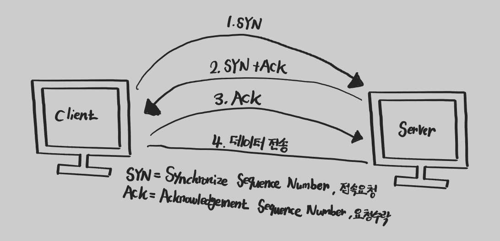
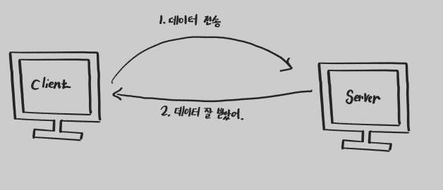
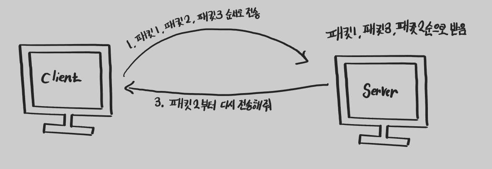

> [이곳](https://chobobdev.github.io/p/%EB%AA%A8%EB%93%A0-%EA%B0%9C%EB%B0%9C%EC%9E%90%EB%A5%BC-%EC%9C%84%ED%95%9C-http-%EC%9B%B9-%EA%B8%B0%EB%B3%B8-%EC%A7%80%EC%8B%9D1.2%EC%9D%B8%ED%84%B0%EB%84%B7-%ED%94%84%EB%A1%9C%ED%86%A0%EC%BD%9Cip/)에서 설명했듯이 IP 프로토콜 만으로는 Packet의 온전한 도착을 보장할 수 없다. 이는 TCP등을 통하여 IP의 문제점을 보완해 줄 수 있다.

## 인터넷 프로토콜 스택의 4계층

네트워크를 배웠다면 OSI 7계층 모델은 익숙할 것이다. 
TCP/IP 4계층 모델은 OSI 7계층을 단순화한 모델이다. TCP/IP 4계층 모델은 상업적이고 실무적으로 이용되기에 OSI 7계층 모델보다 적합한 모델이다.

### TCP/IP 4계층
#### Application Layer : 응용 계층
응용 계층에서의 데이터 단위는 Data 혹은 Message이다.  
응용 계층은 사용자와 가장 가까운 계층으로 user 와 software 간의 소통을 담당하는 계층이다.  

#### Transport Layer : 전송 계층
전송 계층에서의 데이터 단위는 `Segment`이다. 각 `Segment`에는 출발지 PORT 와 목적지 PORT, 전송제어, 순서 및 검증정보등을 담고 있다.  
전송 계층은 PORT 번호를 이용하여 전송받는 기기의 정확한 애플리케이션에 데이터를 전송한다.  
전송 계층은 통신 노드 간의 신뢰성 있는 통신을 담당하는 계층이다.  

#### Internet Layer : 인터넷 계층
인터넷 계층에서의 데이터 단위는 `Packet`이다. 각 `Packet`에는 출발지 IP 와 목적지 IP와 같은 정보를 담고 있다.   
인터넷 계층은 IP 주소를 할당하여 네트워크 상 최종 목적지까지 정확하게 데이터를 전송한다.  
인터넷 계층은 Routing 기능을 담당하는 계층이다.

#### Network Interface Layer : 네트워크 인터페이스 계층
네트워크 인터페이스 계층에서의 데이터 단위는 Frame이다.  
네트워크 인터페이스 계층은 IP 주소와 같은 논리 주소가 아닌 MAC 주소와 같은 물리주소를 참조해 장비 간 데이터를 전송한다.  

#### 네트워크에서 메세지가 전달되는 과정
1. User 가 Application과 소통하여 전해야할 Data가 만들어진다.
2. Socket 라이브러리를 통해 데이터가 이동한다.
3. 주어진 Data에 TCP 세그먼트를 생성하여 추가한다.
4. 주어진 TCP 정보를 포함한 Data에 IP패킷을 생성하여 추가한다.
5. LAN 카드를 통하여 Ethernet Framework이 생성되고 이는 최종 목적지를 향한다.

## TCP 프로토콜이란
TCP (Transmisson Control Protocol) 는 전송 제어 프로토콜을 의미한다.  
TCP 에는 크게 3가지 특징을 가지고 있다.  
1. TCP는 연결 지향적이다, `3-WAY HANDSHAKE`를 통한 목적지와 가상 연결을 통하여 목적지와의 연결 여부를 확인한다.
2. TCP는 데이터의 전달을 보증한다. 만약 Packet이 전송 도중 누락이 되었다면, 이는 TCP를 통하여 인지할 수 있다.  
3. TCP는 Packet의 순서를 보장한다.

### TCP의 Three Way Handshake (가상연결)

1. Client에서 Server로 연결 요청을 한다.
2. Server에서 연결수락과 Client에 연결 요청을 한다.
3. Client가 연결을 수락한다
4. 데이터 전송이 시작된다
   > 3번 과정과 4번 과정은 동시에 진행될 수 가 있다.

Client 와 Server는 개념적으로만(논리적으로만) 연결이 된 것 이다.

### TCP의 데이터 전달 보증

TCP 프로토콜이 데이터의 전달을 보증하는 방법은 다음과 같다.
TCP 프로코콜은 데이터를 전송받을 경우 잘 받았다는 response를 보내기 때문에 데이터가 잘 전송이 되었는지 알 수 있다.

### TCP의 순서 보장

서버의 최적화 상태에 따라 달라 질 수 있다. 가장 기본적인 TCP 프로토콜의 순서 보장 방식은 다음과 같다.

서버에서 받은 패킷의 순서가 다음과 같이 패킷2번보다 패킷3번이 먼저 도착할 경우, 서버는 클라이언트에게 패킷 2번부터 재전송 요청을 한다. 이는 TCP 세그먼트에 전송제어 정보, 순서 및 검증 정보가 포함되어 있기 때문에 가능하다.

## UDP 프로토콜이란
User Datagram Protocol (사용자 데이커그램 프로토콜)
> 기능이 없다????

하얀 도화지에 비유 한다. 기능이 거의 없다.  
TCP와 다르게 연결지향적이 않고, 데이터 전달 보증도 하지 않으며 순서를 보장하지 않는다.  
데이터 전달 및 순서가 보장되지 않지만 단순하고 빠르다는 장점이 있다.  
IP 와 기능의 거의 같으며 PORT 정보와 체크섬 정도만 추가로 가지고 있다.  
위의 이유들 때문에 UDP는 애플리케이션에서 따로 작업이 필요하다.  

> 본 글은 김영한 님의 [모든 개발자를 위한 HTTP 웹 기본 지식](https://www.inflearn.com/course/http-%EC%9B%B9-%EB%84%A4%ED%8A%B8%EC%9B%8C%ED%81%AC/dashboard)을 보고 정리한 글입니다.