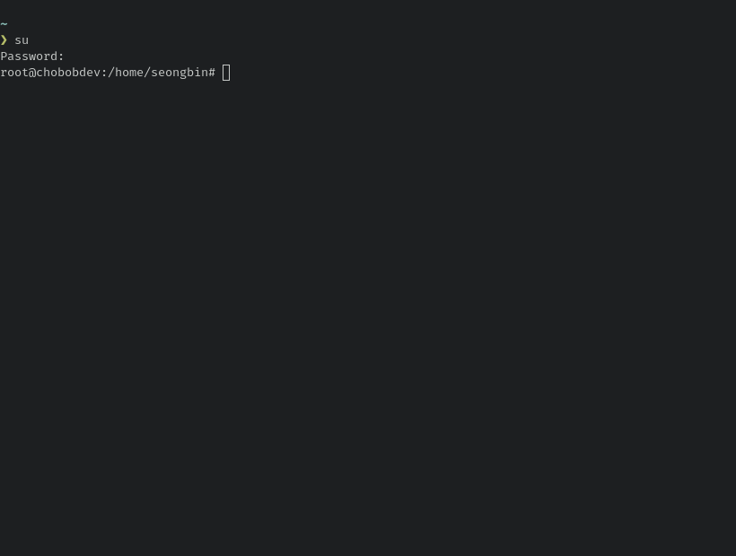

## 쉘이란 무엇인가 ?
쉘이란 키보드로 입력한 명령어를 운영체제에 전달하여 이 명령어를 실행하게 하는 프로그램이다.
대부분의 리눅스 배포판은 bash라고 하는 GNU 프로젝트의 쉘 프로그램을 제공한다. 
bash라는 이름은 Bourne Again Shell의 약어로 스티브 본(Steve Bourne)이 개발한 최초 유닉스 쉘 프로그램인 sh의 확장판이라는 의미를 담고있다.

## 터미널 에뮬레이터 
터미널 에뮬레이터는 GUI 환경에서 쉘과 직접 작업할 수 있도록 한다. 
리눅스에는 다양한 터미널 에뮬레이터가 있다, 다 같은 기능을 하지만 필자는 `Alacritty`라는 에뮬레이터에 `zsh` 를 설정하여 사용하고 있다. 

> TMI 이지만 zsh theme은 starship 을 사용한다. ~~그러하다 필자는 요즘 러스트가 좋다 ㅎ~~

zsh에 theme을 설정하였기 때문에 보이지 않지만 슈퍼유저(su) 가 아니라고 한다면 `$` 표시가 기본적으로 노출이 된다.
하지만 해당 터미널 세션이 su 권한을 가지고 있다면 `#` 표시가 노출 될 것이다. 
   
다음 사진처럼 말이다. 

대부분의 터미널은 가장 최근 500개의 명령어를 기억하고 있으며 이는 방향키 위 와 아래로 자유롭게 이동 가능하다, 또한 커서를 이동하여 특정 부분을 수정하여 명령어를 쉽게 편집 할 수 도 있다.

다음은 다양한 터미널 명령어들의 예시이다.

`df`, `date`, `free` 와 `ls` 처럼 우리는 다양한 상황에서 다양한 커먼드를 활용하여 여러 작업을 수행 할 수 있다.

## 터미널 세션 종료
터미널 세션을 종료하는 방법은 두 가지이다. 직접 터미널 에뮬레이터 창을 닫거나 쉘 프로프트에 `exit` 명령어를 입력하면 터미널 세션이 종료된다.

> [출처] 리눅스 커맨드라인 완벽 입문서 
